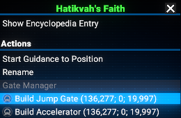
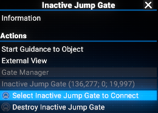
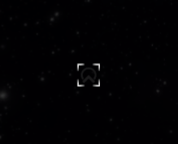
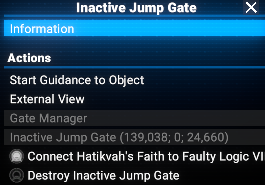
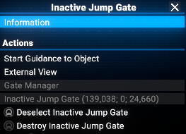
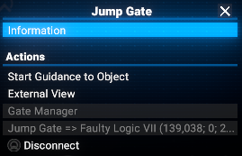
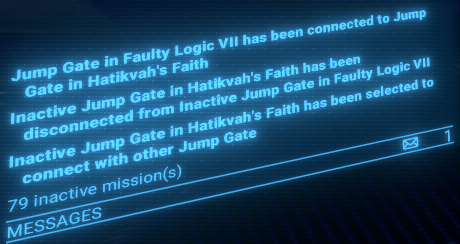
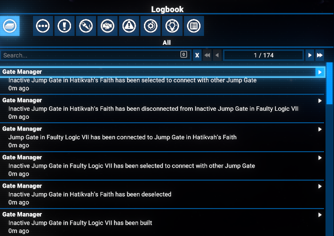

# Gate Manager: connecting ... sectors

Adds map context actions to build, connect and destroy player-defined Jump Gates and Accelerators.

## Compatibility

Compatible with `X4: Foundations 7.60` and upper. At least it written and tested with versions `7.60` and `8.00`.

## Features

- Build Jump Gates and Accelerators in the Galaxy Map view
- Connect Jump Gates and Accelerators to create travel routes (is only possible to connect Gates to Gates or Accelerators to Accelerators)
- Disconnect Jump Gates and Accelerators (player-built ones as well as original ones)
- Destroy unwanted Jump Gates and Accelerators (only player-built ones)
- For Gates used the `props_gates_anc_gate_macro` model, for Accelerators used the `props_gates_orb_accelerator_01_macro` model

## Download

You can download the latest version via Steam client - [Gate Manager](https://steamcommunity.com/sharedfiles/filedetails/?id=3577926900)
Or you can do it via the Nexus Mods - [Gate Manager](https://www.nexusmods.com/x4foundations/mods/1842)

## Dependencies

As it uses context menu in the Galaxy Map view, it requires the `Mod Support APIs` by [SirNukes](https://next.nexusmods.com/profile/sirnukes?gameId=2659) to be installed and enabled. Version `1.93` and upper is required.

- It is available via Steam - [SirNukes Mod Support APIs](https://steamcommunity.com/sharedfiles/filedetails/?id=2042901274)
- Or via the Nexus Mods - [Mod Support APIs](https://www.nexusmods.com/x4foundations/mods/503)

## How to use

After installation, you can use the context menu in the Galaxy Map view to build, connect, disconnect and destroy Jump Gates and Accelerators.

### Build

- Open the Galaxy Map view
- Right-click in the sector on position where you want to build a Jump Gate or an Accelerator
- Select the `Build Jump Gate` or `Build Accelerator` option from the context menu
- The Jump Gate or Accelerator will be built in the selected sector exactly in the selected position.

By default, the Jump Gate or Accelerator will be oriented from "South" to "North". If you want to change the orientation, please read the appropriate section below.

### Connect

Applicable as for newly built objects as well as for original ones.

- Open the Galaxy Map view
- Right-click on the Jump Gate or Accelerator you want to connect. (It must be already built and inactive, i.e. not currently connected.)
- Select `Select [Inactive Jump Gate|Accelerator] to connect` option from the context menu
- This object will be marked as selected
- Right-click on the Jump Gate or Accelerator you want to connect to
- Select `Connect [Sector] to [Sector]` option from the context menu
- Appropriate connection will be created between the two objects

#### Inactive object (not currently connected)

#### Selected object

#### Context menu when other object is selected to connect to

#### Limitations

- It is not possible to connect already connected objects
- It is only possible to connect Jump Gates to Jump Gates or Accelerators to Accelerators
- It is only possible to connect objects in different sectors

##### Deselect

If you already marked some object as selected. to make possible to select another one, you need to deselect the already selected object.

- Right-click on the already selected Jump Gate or Accelerator. (It must be already marked as selected if you not changed the selection.)
- Select `Deselect` option from the context menu

### Disconnect

- Open the Galaxy Map view
- Right-click on the Jump Gate or Accelerator you want to disconnect. (It must be already built and active, i.e. currently connected.)
- Select `Disconnect` option from the context menu
- The connection will be removed and the objects will be inactive
- You can connect them again, or destroy (if it was a player-built one) them if you don't need them anymore

### Destroy

- Open the Galaxy Map view
- Right-click on the Jump Gate or Accelerator you want to destroy. (It must be built by the player and inactive, i.e. not currently connected.)
- Select `Destroy ...` option from the context menu
- The object will be removed from the Galaxy Map

**Warning:** Some original gates and accelerators can be identified as player-built ones, due to some specifics. So please be careful when destroying the objects.

### Change orientation

By default, the Jump Gate or Accelerator will be oriented from "South" to "North" for the current map orientation.
It is mean, that you will "enter" the object from "South" to "North". But exiting the opposite object will be from "North" to "South".

So, if you want to make a route more effective, please orient the Gates/Accelerators accordingly, i.e. to have the "entrance" in the direction of the destination sector. From both sides of the connection.

Please take in account, that the orientation is dependent on the current map orientation. By default, the map orientation is "South" to "North", i.e. "South" is at the bottom of the map and "North" is at the top of the map.
I.e. if you want to build the object oriented from "West" to "East", i.e. target sector is on a right hand for current, you need to rotate the map to have "West" at the bottom of the map (for source sector).
And make it opposite for the target sector, i.e. rotate the map to have "East" at the bottom of the map.
All of these is valid if you place the object in the closest border to opposite sector.

To reset map orientation, please use the '.' hotkey to focus map on your current position. In this case orientation will be "South" to "North" for a whole map.

## Logging

### Notifications

All your actions will be shown in notification window (not really useful in the Map view).

### Logbook

In addition, all your actions will be logged in the logbook (accessible via the Player Information menu).

## Video

[Video demonstration of the Gate Manager. Short one](https://www.youtube.com/watch?v=bpB_Y5TShgw)
[Video demonstration of the Gate Manager. Full one](https://www.youtube.com/watch?v=4TyMagNIVC0)

## Credits

- Author: Chem O`Dun, on [Nexus Mods](https://next.nexusmods.com/profile/ChemODun/mods?gameId=2659) and [Steam Workshop](https://steamcommunity.com/id/chemodun/myworkshopfiles/?appid=392160)
- *"X4: Foundations"* is a trademark of [Egosoft](https://www.egosoft.com).

## Acknowledgements

- [EGOSOFT](https://www.egosoft.com) - for the game itself (In fact - for the series of games)!
- Enormous big thank to [Forleyor](https://github.com/Forleyor), for his help with Lua! For make me curious about it and for his patience! Without him I will never touched the Lua and started to make this mod!
- Thanks to all members of the [X4 modding channel](https://discord.com/channels/337098290917146624/502057640877228042) on [Egosoft Discord](https://discord.com/invite/zhs8sRpd3m).
- Thanks to [SirNukes](https://next.nexusmods.com/profile/sirnukes?gameId=2659) for his awesome `Mod Support APIs` without which this mod would not be possible!

## Change Log

### [1.00] - 2025-10-01

- Added
  - Initial public version
